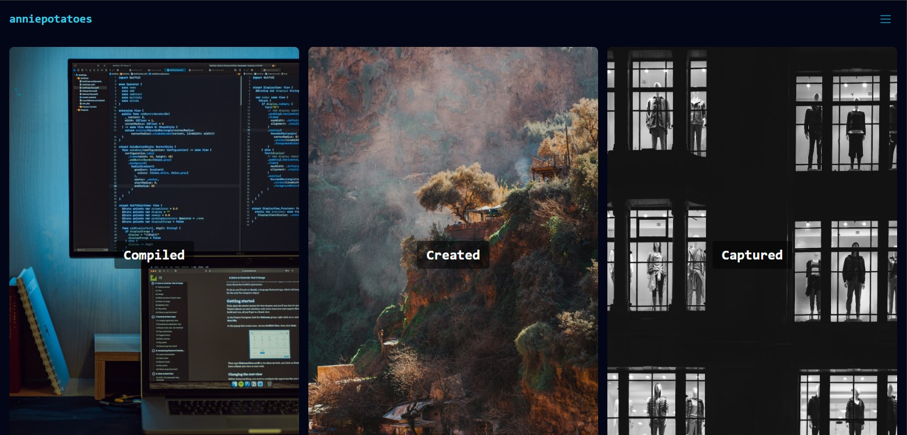

# stphluo

A sleek, responsive personal portfolio site built with **React**, **TypeScript**, and **Tailwind CSS**. This site showcases my full-stack engineering work (`Compiled`), creative coding and design projects (`Created`), and original photography (`Captured`). It features dark/light mode, smooth page transitions, and a mobile-optimized slide-out navigation menu.



---

## Features

- **Dark / Light Mode** toggle with animated slider and emoji indicators  
- **Tailwind CSS** styling for modern layout and responsiveness  
- **Sticky navigation bar** with mobile slide-out menu  
- **Image gallery** with optimized loading and responsive aspect ratios  
- **Smooth transitions** between routes with fade-in/fade-out animation  
- Fully responsive design for all screen sizes  
- GitHub integration and project links  

---

## Project Structure

```
src/
├── assets/            # All static images and assets
├── components/        # Shared UI components (e.g. NavigationBar)
├── hooks/             # Custom React hooks (e.g. useDarkMode)
├── pages/             # Route-based pages: Home, Compiled, Created, Captured
├── App.tsx            # Main app component
├── main.tsx           # Entry point
└── index.css          # Tailwind + global styles
```

---

## Getting Started

1. **Clone the repo**
   ```bash
   git clone https://github.com/fillersury/stphluo.git
   cd stphluo
   ```

2. **Install dependencies**
   ```bash
   npm install
   ```

3. **Run the development server**
   ```bash
   npm run dev
   ```

4. **Build for production**
   ```bash
   npm run build
   ```

---

## 🌍 Live Demo

> Deployed at: [https://anniepotatoes.me](https://anniepotatoes.me)

---

## Built With

- [React](https://react.dev/)
- [TypeScript](https://www.typescriptlang.org/)
- [Tailwind CSS](https://tailwindcss.com/)
- [Vite](https://vitejs.dev/)
- [React Router](https://reactrouter.com/)
- [Heroicons / React Icons](https://react-icons.github.io/react-icons/)

---

## 📸 Credits

All images on the site were taken and edited by me.

---

## About Me

I'm a full-stack engineer based in NYC with 4+ years of experience building modern web applications in React and .NET Core. I love clean code, elegant design, and visual storytelling.

---

## Contact

📫 [annieluo.gobucks@gmail.com](mailto:annieluo.gobucks@gmail.com)
📸 [instagram.com/anniepotatoes](https://instagram.com/anniepotatoes)

---

## License

MIT — [see LICENSE](LICENSE)
